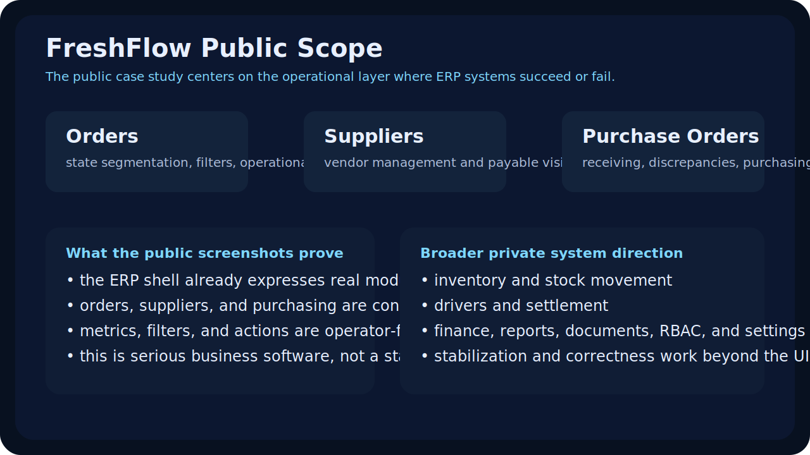
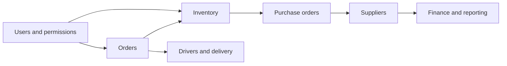
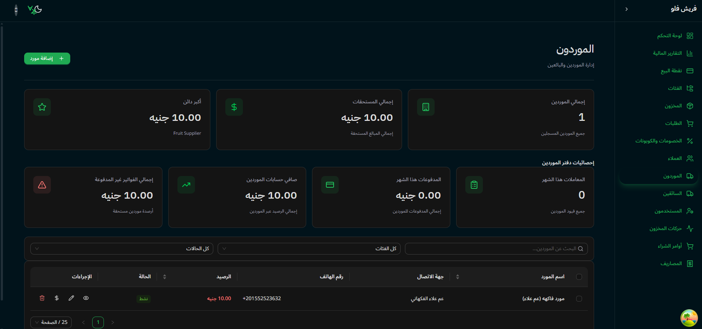
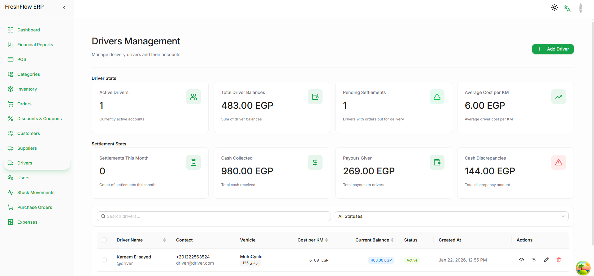
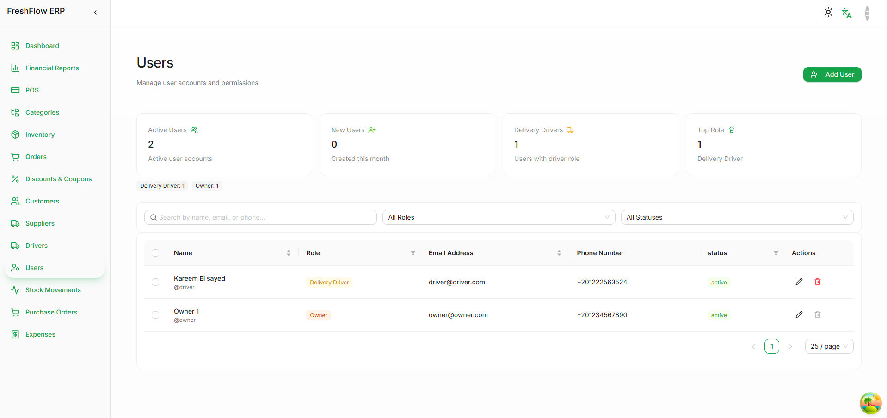
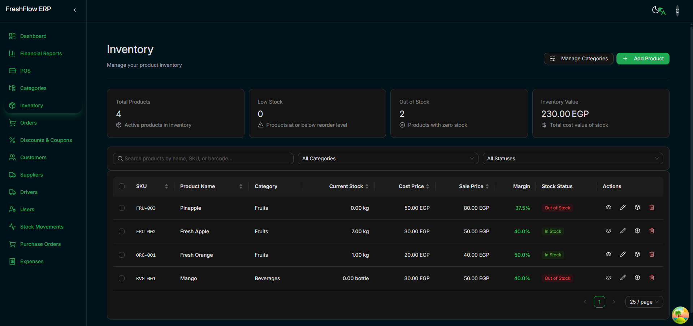

# FreshFlow Showcase

Public-safe case study and screenshot showcase for FreshFlow ERP.

This repo is the public explanation layer for a broader ERP direction built in collaboration with my developer friend [m4hosam](https://github.com/m4hosam). It uses real interface screenshots and public-safe framing to show the product surface without exposing backend logic, secrets, or customer-specific implementation details.

## Supporting docs

- [Operational scope](docs/operational-scope.md)
- [Stabilization notes](docs/stabilization-notes.md)

## What this showcase demonstrates

- orders operations and order-state visibility
- supplier and payable workflows
- purchase order handling
- drivers, users, and inventory administration
- Arabic-aware module organization inside a broader ERP shell

## Product framing

FreshFlow is aimed at the day-to-day coordination problems that make operational software feel fragmented:

- orders, purchasing, stock, and supplier balances often drift apart
- delivery and driver operations are handled outside the main ERP story
- finance-facing views and operations-facing views are separated too sharply
- module breadth grows, but the workspace shell loses coherence

The public screenshots here are meant to show that the direction is operationally broad, not just a few isolated pages.

## Operational map

## Screenshot walkthrough

<table>
  <tr>
    <td width="50%" valign="top">
      
       
      <strong>1. Orders operations</strong>
       
      The orders surface shows filters, metrics, and operator table states rather than a decorative dashboard. It signals that order management is treated as active daily work.
    </td>
    <td width="50%" valign="top">
      
       
      <strong>2. Purchase orders</strong>
       
      Purchasing is framed with its own workflow metrics and status visibility, which matters because procurement usually breaks when it is hidden behind generic inventory UI.
    </td>
  </tr>
  <tr>
    <td width="50%" valign="top">
      
       
      <strong>3. Suppliers and payables</strong>
       
      Supplier balance, payable context, and vendor records are treated as first-class operational surfaces, not side spreadsheets.
    </td>
    <td width="50%" valign="top">
      
       
      <strong>4. Arabic supplier workflow</strong>
       
      This capture is useful because it proves the system direction is comfortable in Arabic, not just in English admin layouts.
    </td>
  </tr>
  <tr>
    <td width="50%" valign="top">
      
       
      <strong>5. Drivers management</strong>
       
      Driver balances, settlement state, and cost metrics show that delivery operations are part of the ERP surface rather than external tooling.
    </td>
    <td width="50%" valign="top">
      
       
      <strong>6. Users and permissions</strong>
       
      The users surface shows that the workspace is not only about transactions; it also includes operator administration and role-aware business workflows.
    </td>
  </tr>
  <tr>
    <td width="50%" valign="top">
      
       
      <strong>7. Inventory administration</strong>
       
      Inventory shows stock visibility, pricing, statuses, and action controls in a more advanced operational context than a simple catalog table.
    </td>
  </tr>
</table>

## Operational coverage visible from the public layer

- orders are treated as active operations rather than passive records
- suppliers, purchasing, and inventory are framed as one connected business workflow
- drivers and users prove the system extends beyond stock and invoicing screens
- Arabic and English views both support the same broader ERP direction

## What the screenshots prove

- FreshFlow is broader than a single dashboard or storefront shell
- orders, suppliers, purchasing, drivers, and users are organized as connected ERP modules
- the public evidence shows real operational screens rather than only marketing pages
- Arabic-aware product direction is visible in the interface, not only in the README copy

## Collaboration note

This showcase represents a collaboration direction. It is not presented as a solo build claim. The public repo exists to explain the product surface honestly while crediting the shared work behind the broader system direction.

## Public vs private boundary

Public here:

- real frontend screenshots
- collaboration attribution
- product framing
- workflow scope explanation

Kept private by design:

- production backend implementation
- environment credentials
- customer data
- business-specific rules and deployment details

## What can be added later

Future public-safe additions can include:

- sanitized architecture notes around ERP frontend, backend, and storefront boundaries
- curated finance and reporting screenshots
- a deeper case study on stabilization, test strategy, and execution sequencing

## Related direction

- Main profile: [KareemQabil](https://github.com/KareemQabil)
- Portfolio: [kerimqabil.me](https://kerimqabil.me)
- Collaborator: [m4hosam](https://github.com/m4hosam)
