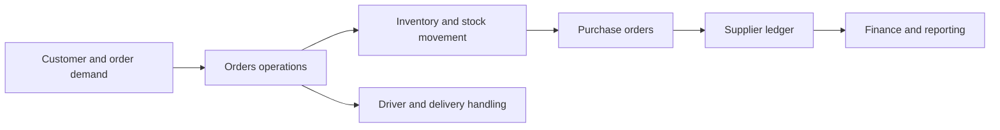
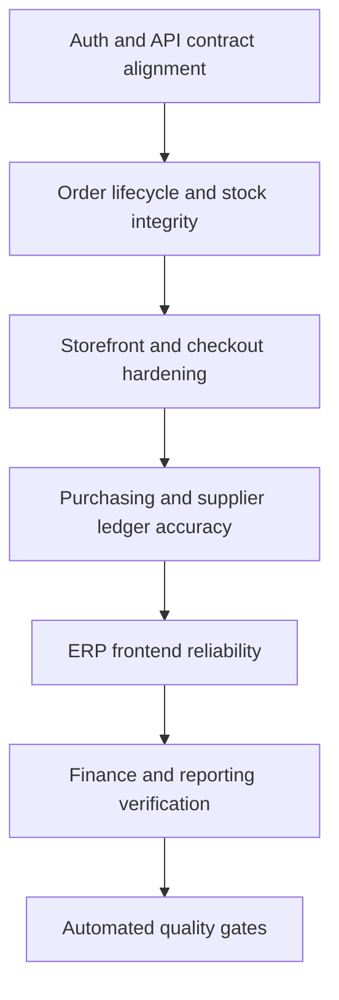
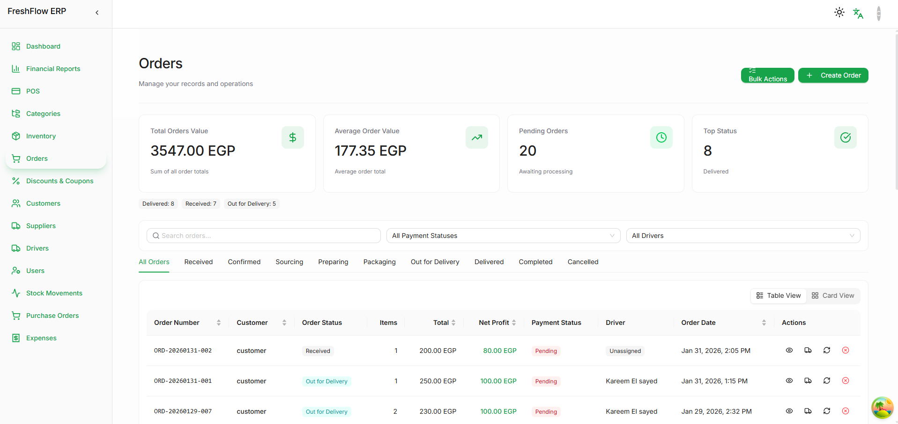
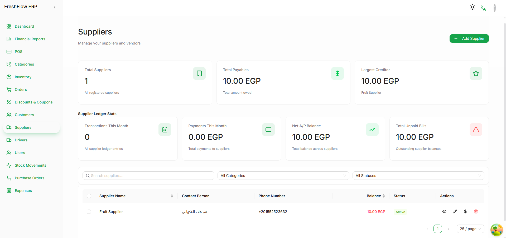
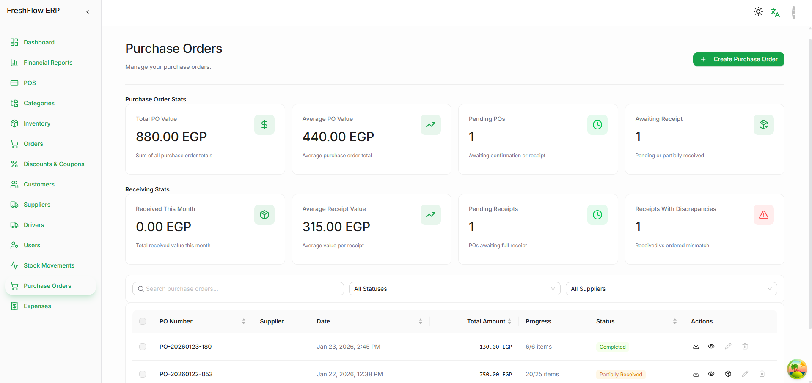

# FreshFlow Showcase

Public-safe case study and screenshot showcase for FreshFlow ERP.

This public layer is based on real frontend screenshots and planning artifacts from the active workspace. It is intended to show the breadth of the ERP surface without exposing raw backend code, environment secrets, or business-sensitive implementation details.

FreshFlow is a collaboration direction built with my developer friend [m4hosam](https://github.com/m4hosam).

## What this showcase covers

- Orders operations surface
- Supplier ledger and vendor management surface
- Purchase order workflow surface
- Stabilization and execution-plan framing for the broader ERP direction

## Product direction

FreshFlow is positioned around day-to-day business operations:

- order lifecycle visibility
- supplier and payable workflows
- purchase order receiving and discrepancy handling
- finance- and operations-facing dashboard surfaces
- Arabic-aware ERP navigation and module organization

## Operational flow map

## Stabilization framing

## Screenshot gallery

### Orders operations

Shows the orders surface with metrics, filter controls, and operational table state.

### Suppliers and payables

Shows the supplier management surface and ledger-facing operational metrics.

### Purchase orders

Shows purchasing workflow metrics and receipt/discrepancy framing.

## Why this repo is public-safe

Public here:

- real screenshots
- collaboration attribution
- product framing
- execution-plan perspective

Kept private by design:

- production backend implementation
- environment credentials
- customer or operational business data
- internal business rules that should not be published raw

## Related direction

- Main profile: [KareemQabil](https://github.com/KareemQabil)
- Portfolio: [kerimqabil.me](https://kerimqabil.me)
- Collaborator: [m4hosam](https://github.com/m4hosam)
