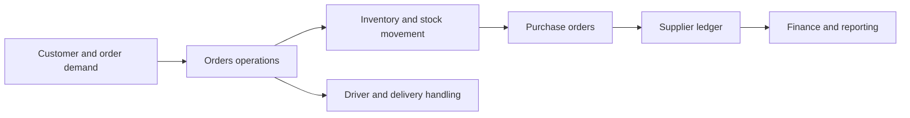
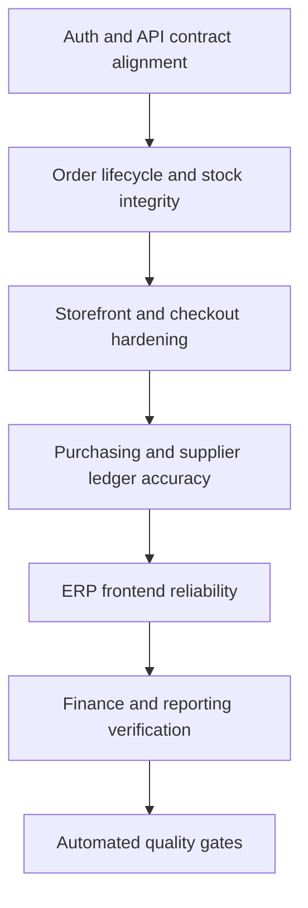

# FreshFlow Showcase

Public-safe case study and screenshot showcase for FreshFlow ERP.

This public layer is based on real frontend screenshots and planning artifacts from the active workspace. It is intended to show the breadth of the ERP surface without exposing raw backend code, environment secrets, or business-sensitive implementation details.

FreshFlow is a collaboration direction built with my developer friend [m4hosam](https://github.com/m4hosam).

## Supporting docs

- [Operational scope](docs/operational-scope.md)
- [Stabilization notes](docs/stabilization-notes.md)

## What this showcase covers

- Orders operations surface
- Supplier ledger and vendor management surface
- Purchase order workflow surface
- Stabilization and execution-plan framing for the broader ERP direction

## Why this product matters

FreshFlow is aimed at the operational layer where business software often breaks down:

- order states become hard to trace across teams
- supplier balances and payables drift away from purchasing reality
- purchase receiving, discrepancies, and stock effects are poorly surfaced
- finance, inventory, and order operations behave like separate systems instead of one workflow

## Who the system appears to serve

- operations owners who need daily visibility into order and inventory flow
- supply or purchasing operators who manage vendor relationships and receiving
- finance-facing users who need supplier balance and payable context
- admins who need a broader ERP shell with permissions, documents, and settings

## Product direction

FreshFlow is positioned around day-to-day business operations:

- order lifecycle visibility
- supplier and payable workflows
- purchase order receiving and discrepancy handling
- finance- and operations-facing dashboard surfaces
- Arabic-aware ERP navigation and module organization

## Broader module map

The public screenshots show only part of the system. Source inspection suggests a broader module surface around:

| Module | Public signal available here |
| --- | --- |
| Orders | Real screenshot in this repo |
| Suppliers | Real screenshot in this repo |
| Purchase orders | Real screenshot in this repo |
| Inventory and stock movement | Referenced in flow and execution plan |
| Drivers and delivery | Present in the route surface, not shown publicly here yet |
| Expenses and financial reports | Present in the route surface, not shown publicly here yet |
| Documents and RBAC | Present in the route surface, not shown publicly here yet |
| ZATCA and settings | Present in the route surface, not shown publicly here yet |

## Operational flow map

## Stabilization framing

The broader execution plan behind the system emphasizes:

- auth and API contract alignment
- order lifecycle and stock integrity
- storefront and checkout hardening
- purchasing and supplier ledger accuracy
- ERP frontend reliability
- finance and reporting verification
- automated quality gates

## Screenshot gallery

### Orders operations

Shows the orders surface with metrics, filter controls, status segmentation, and operational table state.

### Suppliers and payables

Shows the supplier management surface and ledger-facing operational metrics.

### Purchase orders

Shows purchasing workflow metrics, receipt framing, and discrepancy-oriented visibility.

## What the screenshots prove

- the ERP shell is not a placeholder; it already expresses operational modules and consistent navigation
- orders, suppliers, and purchasing are treated as connected business workflows
- metrics, filters, actions, and table states are framed for real operator use instead of empty marketing chrome
- the public layer can show meaningful system breadth without exposing the underlying private implementation

## Collaboration note

This showcase should be understood as a collaboration direction, not a solo claim. The public repo exists to explain the product surface and workflow scope honestly while crediting the shared build effort.

## Why this repo is public-safe

Public here:

- real screenshots
- collaboration attribution
- product framing
- execution-plan perspective

Kept private by design:

- production backend implementation
- environment credentials
- customer or operational business data
- internal business rules that should not be published raw

## What can be added later

Future public-safe additions can include:

- a sanitized architecture map covering ERP frontend, backend, and storefront boundaries
- more screenshots from finance, documents, or delivery operations where safe
- deeper case-study notes around stabilization and testing strategy

## Related direction

- Main profile: [KareemQabil](https://github.com/KareemQabil)
- Portfolio: [kerimqabil.me](https://kerimqabil.me)
- Collaborator: [m4hosam](https://github.com/m4hosam)
